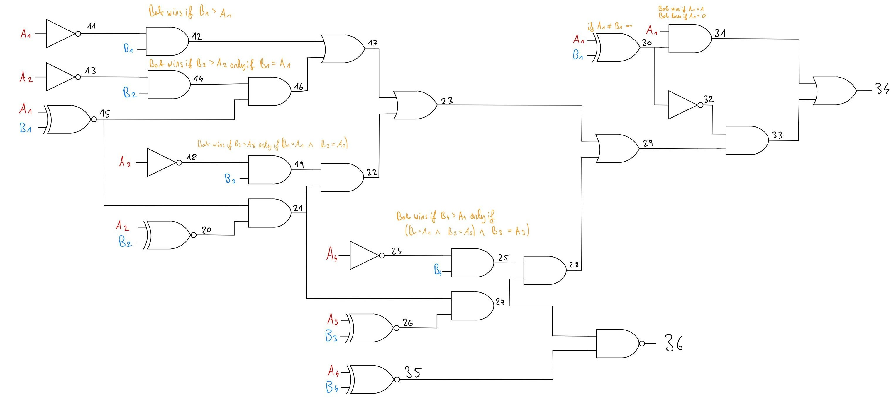

# Secure Maximum Computation with Yao's Garbled Circuits

## Project Description

This project implements a two-party secure computation protocol based on Yao's Garbled Circuits to compute the **maximum of two sets of values**. The implementation builds upon the open-source GitHub library [https://github.com/ojroques/garbled-circuit](https://github.com/ojroques/garbled-circuit), and extends it to support the specific use case of secure maximum computation between two parties.

In this scenario, there are two participants: Alice (the *garbler*) and Bob (the *evaluator*). Each party locally specifies a set of input values via a text file. The protocol securely computes the global maximum such that neither party learns anything about the other party’s individual values or local maximum. The only information revealed is the result of the comparison, encoded as follows:

- `(00)_2`: Both parties have the same global maximum value.
- `(01)_2`: Alice's input set contains the global maximum.
- `(11)_2`: Bob's input set contains the global maximum.

## Prerequisites

**Python Version:** used 3.12.3 (versions 3.6+ should usually also work)  
**Dependencies:** `pyzmq`, `cryptography`, `sympy`  (for testing only: `parameterized`, `flake8`)

### Installation

#### Variant 1: Works for Linux and should also work for Mac.

```bash
chmod +x install.sh
./install.sh
```

#### Variant 2: Doing everything by hand

1. Create a new virtual environment and activate it:

```bash
python3 -m venv .venv
source .venv/bin/activate   # on Linux/Mac
.venv\Scripts\Activate.ps1  # on Windows
```

2. Install the dependencies:

```bash
pip install -e .
```

## Example Usage

1. Navigate to the [/src](/src) directory:

```bash
cd src/
```

2. Define the input values for each party in the respective text files [input_alice.txt](src/input_alice.txt) and [input_bob.txt](src/input_bob.txt) , using a comma-separated list. For example:

```text
-11,-9.7,5,10.1,857.4  # input_alice.txt
-10,5,10.2,564,12558   # input_bob.txt
```

3. In one terminal, start Bob (the *evaluator*):

```bash
python3 main.py bob
```

4. In another terminal, start Alice (the *garbler*):

```bash
python3 main.py alice
```

5. Example output for Alice:

```
[INFO] Inputs: [-11, -9.7, 5, 10.1, 857.4]
[INFO] Local maximum: 857.4
[INFO] 
[INFO] ======== 32-bit CMP signed (two's complement) ========
[INFO] Bob has a larger maximum input.
```

6. Example output for Bob:

```
[INFO] Inputs: [-10, 5, 10.2, 564, 12558]
[INFO] Local maximum: 12558
[INFO] 
[INFO] ======== 32-bit CMP signed (two's complement) ========
[INFO] I have the global maximum input: 12558
```

7. To verify the result without using Yao's protocol, add the `-v` flag:

```bash
python3 main.py alice -v
python3 main.py bob -v
```

8. To enable detailed logging of the communication between Alice and Bob, use the `-l debug` flag:

```bash
python3 main.py alice -l debug
python3 main.py bob -l debug
```

## Circuit Description



The figure above shows a visual representation of a comparison circuit for 4-bit signed integer values. The main objective is to determine whether Bob's input is greater than Alice's. This is achieved by comparing the most significant bit (MSB) of both parties. If `MSB_Bob > MSB_Alice`, Bob "wins", and the output of gate 34 is `(1)_2`. If `MSB_Bob < MSB_Alice`, the output of gate 34 is `(0)_2`. If the MSBs are equal, the comparison continues with the next lower bit, proceeding bit by bit until all have been evaluated.

To distinguish whether Alice has the greater input or both values are equal (when the output of gate 34 is `(0)_2`), gate 36 checks for inequality. It outputs `(1)_2` if the values differ. If gate 36 outputs `(1)_2` and gate 34 outputs `(0)_2`, then Alice "wins". If both gates output `(1)_2`, Bob wins. If both gates output `(0)_2`, the inputs are equal.

The circuit also correctly handles negative numbers using [Two's complement representation](https://en.wikipedia.org/wiki/Two%27s_complement), where a negative number is indicated by its MSB being `1`. If both inputs are either positive or negative, the original comparison logic applies. However, if only one input is negative, an additional check is necessary. If Alice’s value is negative (`MSB_Alice = 1`, `MSB_Bob = 0`), then Bob has the greater input, and gate 34 should output `(1)_2`. Conversely, if Alice has a positive value and Bob a negative one (`MSB_Alice = 0`, `MSB_Bob = 1`), gate 34 should output `(0)_2`. This logic is equivalent to checking whether `MSB_Alice ≠ MSB_Bob` and outputting `MSB_Alice`.

The circuits are defined in JSON format under [src/circuits](src/circuits), following the same structure as in the referenced GitHub library. To scale the 4-bit circuit to larger sizes (e.g., 32-bit), the Python script [generate_cmp_signed_circuit.py](src/circuits/generate_cmp_signed_circuit.py) can be used to generate circuits of arbitrary bit lengths. To support floating-point numbers with **at least one digit before and after the decimal point**, inputs are simply always scaled by a factor of 10 and casted to integers.

## Implemented Tests

The file [tests/test_protocol_manager.py](tests/test_protocol_manager.py) contains unit tests for the [ProtocolManager](src/protocol_manager.py). It verifies correct protocol initialization, result computation between Alice and Bob, and supports various input types (integers, floats, and mixed). Edge cases for 16-bit integers and floating-point boundaries are also tested.

To run all tests, execute the following command from the project root directory:

```bash
python3 -m unittest
```

## Comment on AES

The referenced GitHub library uses the Python module `Fernet` for encrypting garbled tables in `garbled_circuit/yao.py`. It is important to note that **Fernet internally relies on AES in CBC mode with a 128-bit key and PKCS7 padding**, as specified in the [official documentation](https://cryptography.io/en/latest/fernet/#implementation) and the [Fernet specification](https://github.com/fernet/spec/blob/master/Spec.md).

Since `Fernet` provides authenticated symmetric encryption and hides low-level cryptographic details, its use ensures confidentiality and integrity of the garbled tables in a practical and reliable way. For the purposes of this project, the use of AES via `Fernet` is considered acceptable, as it does not compromise the security model or goals of Yao’s garbled circuit protocol.
